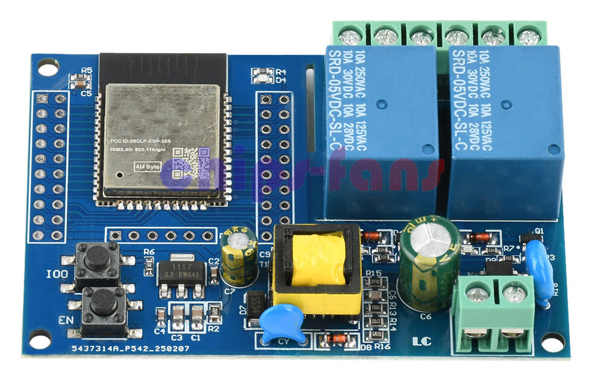

# ESP32 Art-Net Relay Controller

Two-relay ESP32 controller for simple on/off lighting control via **Art-Net 4 / DMX over WiFi**.

## Features

* Art-Net 4 / DMX over WiFi
* Two onboard relay outputs
* Configurable DMX channels
* Configurable Art-Net universe
* Web-based configuration and status interface
* Up to three stored WiFi networks
* Fallback open access point for initial configuration
* Persistent configuration across reboots
* Serial debugging
* Lightweight implementation with no unnecessary functionality

## Hardware

ESP32-based two-relay board.

| Relay   |   GPIO |
| ------- | -----: |
| Relay 1 | GPIO16 |
| Relay 2 | GPIO17 |

eBay listing: https://www.ebay.co.uk/itm/277016777105

## Documentation

See **[SPEC.md](SPEC.md)** for the complete firmware specification.