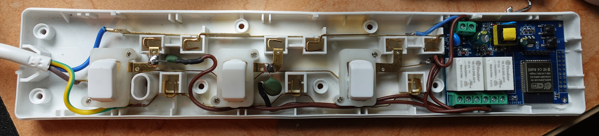

# ESP32 Art-Net Relay Controller

Two-relay ESP32 controller for simple on/off lighting control via **Art-Net 4 / DMX over WiFi**.

The image below shows the board fitted inside a trailing mains extension lead. Note that the plug fuse has been changed to 3A, since the standard 13A fuse would exceed the rating of the relays.

Unfortunately the cheap relays in the board had a tendency to weld the contacts closed when switching capacitive loads, so I swapped them out for a relay with different contact material (Finder 36.11.9.005.4011), and also added NTC inrush limiters in series with the load to further protect the contacts.

## Features

* Art-Net* 4 / DMX over WiFi
* Two onboard relay outputs
* Mains powered
* Configurable DMX channels
* Configurable Art-Net universe
* Web-based configuration and status interface
* Up to three stored WiFi networks
* Fallback open access point for initial configuration
* Persistent configuration across reboots
* Serial debugging
* Lightweight implementation with no unnecessary functionality

*Art-Net™ Designed by and Copyright Artistic Licence Engineering Ltd

## Hardware

ESP32-based two-relay board.

| Relay   |   GPIO |
| ------- | -----: |
| Relay 1 | GPIO17 |
| Relay 2 | GPIO16 |

* eBay listing of board: https://www.ebay.co.uk/itm/277016777105
* Replacement relays: Finder 36.11.9.005.4011
* Inrush protection: TKS SCK-10502MS 50 Ohms 2A NTC Thermistor
* Mains extension lead: Pro Elec PEL00514

## Documentation

See **[SPEC.md](SPEC.md)** for the complete firmware specification.